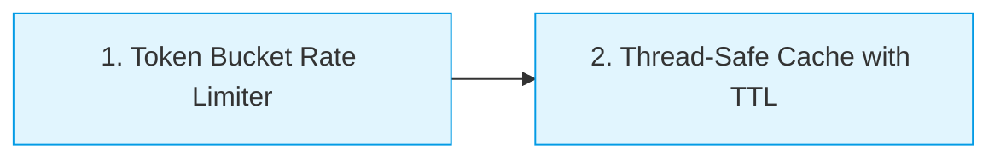
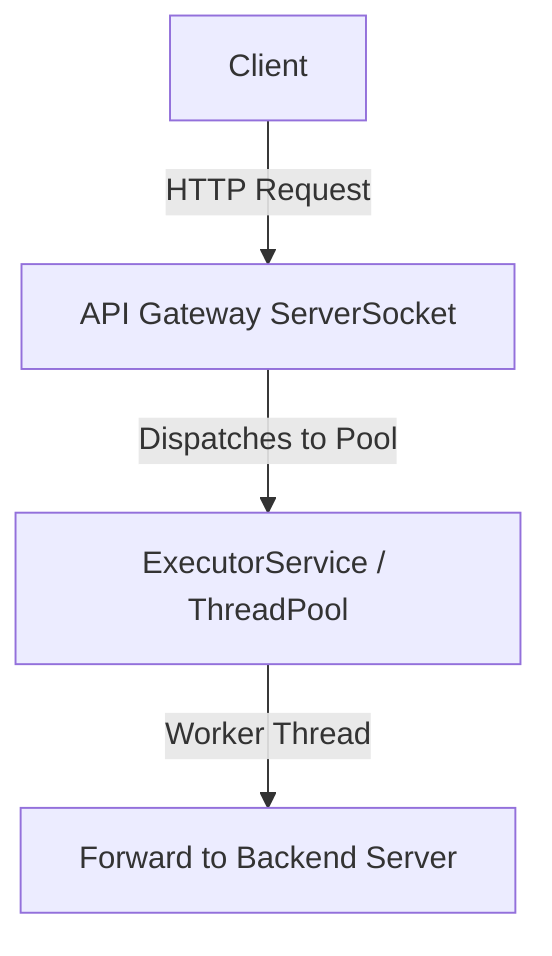
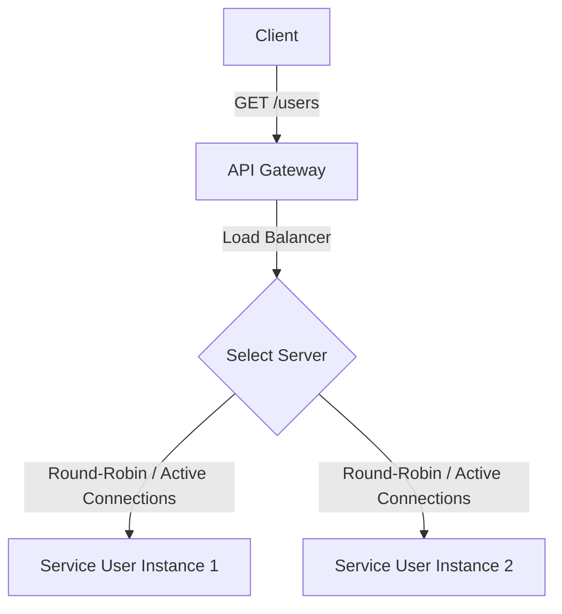

# Java Multithreading Revision Chart & API Gateway Learning Roadmap

This document provides a conceptual revision chart for Java Multithreading and details how to learn and apply these concepts step-by-step to build a **High-Performance API Gateway** from scratch.

---

## 🗺️ Concurrency Concept Map

```mermaid
graph TD
    A[Java Concurrency & Multithreading] --> B[Foundational Concepts]
    A --> C[Synchronization & Locking]
    A --> D[Concurrency Utilities]
    A --> E[High-Performance Concurrency]

    B --> B1["Thread Lifecycle (Runnable, Blocked, Waiting)"]
    B --> B2["Race Conditions & Shared Mutability"]
    B --> B3["Memory Visibility & volatile"]

    C --> C1["Implicit Locking (synchronized)"]
    C --> C2["Explicit Locks (ReentrantLock)"]
    C --> C3["Read/Write Locks (ReentrantReadWriteLock)"]
    C --> C4["Optimistic Locking (StampedLock)"]

    D --> D1["ThreadPools & ExecutorService"]
    D --> D2["Concurrent Collections (ConcurrentHashMap, BlockingQueue)"]
    D --> D3["Atomic Variables (AtomicInteger, LongAdder)"]
    D --> D4["Synchronizers (CountDownLatch, Semaphore, CyclicBarrier)"]

    E --> E1["CompletableFuture (Async/Non-blocking)"]
    E --> E2["Virtual Threads (Project Loom - Java 21)"]
    E --> E3["Reactive Streams (Flow API / RxJava)"]
```

---

## ⚡ Revision Chart: Core Java Concurrency Concepts

| Category | Concept | Key Java Class/Keyword | Why it Matters | API Gateway Use Case |
| :--- | :--- | :--- | :--- | :--- |
| **Visibility** | **Memory Visibility** | `volatile` | Ensures changes made by one thread are immediately visible to others. Avoids CPU cache stale reads. | Reading dynamic configuration (e.g., active backends list, routing tables). |
| **Atomic Ops** | **Compare-And-Swap (CAS)** | `AtomicInteger`, `AtomicReference` | Lock-free thread-safe updates to single variables. Highly performant under low-to-medium contention. | Incrementing metrics, counting current active connections, request sequence IDs. |
| **Locking** | **Mutual Exclusion (Mutex)** | `ReentrantLock` | Restricts access to a resource to one thread at a time. Supports timeouts, fair queuing, and interruptibility. | Serializing writes to an internal status log or modifying active service state. |
| **Locking** | **Reader-Writer Separation** | `ReentrantReadWriteLock` | Allows multiple threads to read concurrently, but only one to write. Excellent for read-heavy resources. | Thread-safe route table lookup (frequent reads, rare updates). |
| **Locking** | **Optimistic Reading** | `StampedLock` | Optimistic read mode doesn't block writers; validates read afterwards. Highly performant. | Fast-path configurations lookup. |
| **Signaling** | **Coordination & Waiting** | `Condition`, `wait()` / `notify()` | Allows a thread to suspend execution until a specific condition is met. | Worker pool waiting for inbound HTTP requests. |
| **Coordination** | **Throttling & Resource Limits** | `Semaphore` | Restricts the number of threads that can access a resource simultaneously. | **Rate Limiting / Concurrency Limiter** (e.g., max 50 concurrent requests per client IP). |
| **Coordination** | **Barriers & Latches** | `CountDownLatch`, `CyclicBarrier` | Blocks threads until other threads complete a set of operations. | Awaiting connection initialization to upstream microservices on startup. |
| **Collections** | **Lock-Free Map** | `ConcurrentHashMap` | Highly scalable thread-safe map using lock striping (Java 7) / CAS node-level locks (Java 8+). | Storing API rate-limit buckets, caching user authentication tokens. |
| **Collections** | **Producer-Consumer Queues** | `BlockingQueue` | Thread-safe queue where take/put block if the queue is empty/full. | **Asynchronous Logger** (request logs are queued and flushed by background threads). |
| **Executors** | **Thread Management** | `ExecutorService`, `ThreadPoolExecutor` | Decouples task submission from execution. Reuses threads to avoid the overhead of thread creation. | Managing the pool of worker threads processing HTTP client requests. |
| **Modern Java** | **Asynchronous Pipelines** | `CompletableFuture` | Represents a future result. Supports non-blocking callbacks, mapping, and combining multiple tasks. | Aggregating responses from multiple upstream services in parallel. |
| **Modern Java** | **Lightweight Threads** | **Virtual Threads** (Java 21+) | User-space threads mapped to carrier threads. Allows writing simple block-per-request code that scales like reactive. | **Highly Scalable Request Handlers**. Essential for modern high-performance Java servers. |

---

## 🛠️ Project-Based Learning Roadmap: Building an API Gateway

Yes! Building an API Gateway is **completely possible** and is a fantastic way to transition from theoretical multithreading to production-grade software engineering.

Below is the step-by-step roadmap designed to take you from a basic concurrency learner to building a fully functional, multithreaded API Gateway.

### Phase 1: The Building Blocks (Warm-up Exercises)
Before writing networking code, build these thread-safe utility structures using the concurrency concepts you revised.

1. **Token Bucket Rate Limiter**
   * **Goal**: Limit how many requests a client can send per second.
   * **Concepts Used**: `ScheduledExecutorService` (for token replenishment), `AtomicInteger` or `Semaphore` (to acquire tokens thread-safely).
   * **Exercise**: Implement a class `TokenBucketRateLimiter(int maxTokens, int refillRatePerSec)` with a method `boolean tryConsume()`.

2. **Thread-Safe Cache with Eviction (TTL)**
   * **Goal**: Cache backend service responses or auth tokens.
   * **Concepts Used**: `ConcurrentHashMap`, `ScheduledExecutorService` (to evict expired items), or lazy eviction on lookup using `StampedLock` / CAS.
   * **Exercise**: Build a `ThreadSafeCache<K, V>` where items expire after a configurable duration.

---

### Phase 2: The Foundation (A Multithreaded TCP Server)
An API Gateway is, at its core, a server that listens for incoming client requests and proxies them.

1. **Single-Threaded Echo Server**
   * **Goal**: Understand socket programming.
   * **Action**: Write a simple server using `ServerSocket` that accepts a connection, reads input, and writes it back.
   * **Problem**: Observe how it blocks other clients while servicing the current one.

2. **Multi-Threaded Server (Thread-Per-Request)**
   * **Goal**: Handle multiple concurrent clients.
   * **Action**: Spin up `new Thread(clientSocketHandler).start()` for every incoming socket connection.
   * **Problem**: Observe thread creation overhead. Run a benchmark with 1,000 concurrent requests and watch the OS crash/lag due to thread exhaustion.

3. **Pool-Based Server (The Classic Pattern)**
   * **Goal**: Restrict thread creation using a thread pool.
   * **Action**: Refactor the server to use an `ExecutorService` (specifically `ThreadPoolExecutor` or `Executors.newFixedThreadPool(50)`).
   * **Benefit**: Incoming requests are queued if all pool threads are busy. The system remains stable.

---

### Phase 3: The Intermediate Gateway (Reverse Proxy & Load Balancer)
Now, transform your multithreaded server into a proxy that forwards requests.

1. **HTTP Parser & Forwarder**
   * **Goal**: Parse basic incoming HTTP request lines and forward them to a mock target backend (e.g., an external API or a dummy local server).
   * **Action**: Use Java's `HttpURLConnection` or `HttpClient` inside your worker threads to forward the request and pipe the response back to the client socket.

2. **Routing Table**
   * **Goal**: Route requests based on context path (e.g., `/users/**` -> User Service, `/orders/**` -> Order Service).
   * **Concepts Used**: `ConcurrentHashMap` containing path prefixes to target host mappings.

3. **Load Balancer (Round-Robin & Least Connections)**
   * **Goal**: Distribute requests evenly across multiple backend instances.
   * **Concepts Used**:
     * **Round-Robin**: An `AtomicInteger` incremented modulo the number of target servers.
     * **Least Connections**: A thread-safe map tracking active connections per server instance. Choose the server with the lowest count, increment the count on start, decrement it inside a `finally` block when the request finishes.

---

### Phase 4: Production Features (Security, Resiliency, Logging)
Add critical features that separate a toy proxy from a production-grade API Gateway.

1. **Authentication Cache Integration**
   * **Action**: Intercept requests, validate a mock token, and store valid tokens in your **Thread-Safe Cache** (built in Phase 1) to avoid hitting the auth service on every request.

2. **Circuit Breaker Pattern**
   * **Goal**: Stop routing traffic to a backend instance if it is failing or timing out, preventing cascading failures.
   * **Concepts Used**: A state machine (CLOSED, OPEN, HALF-OPEN) using `AtomicReference` and concurrent transition locks. If request failures exceed a threshold (e.g., 5 failures in 10 seconds), open the circuit and fail fast.

3. **Asynchronous Request Logger**
   * **Goal**: Log request details (path, status, duration) without slowing down client response times.
   * **Concepts Used**: Add log events to a `LinkedBlockingQueue`. Run a background daemon thread that drains the queue and writes logs to a file or console.

---

### Phase 5: High-Performance Gateway (Virtual Threads / Loom)
Modernize your API Gateway using Java 21+ features to achieve extreme concurrency.

1. **Refactor to Virtual Threads**
   * **Action**: Replace `Executors.newFixedThreadPool(50)` with `Executors.newVirtualThreadPerTaskExecutor()`.
   * **Why**: Virtual threads are incredibly cheap (you can spawn millions of them). This gives you the simple blocking "thread-per-request" programming model, but with the performance and scalability of non-blocking I/O.
2. **Benchmark Comparison**
   * Compare throughput (requests per second) and response times under high concurrency between:
     * Standard Thread Pool (50 threads)
     * Virtual Threads
     * Observe the difference when upstream backends are slow (introducing artificial delays).

---

## 📈 Summary Checklist of Concurrency in your API Gateway

Here is where every multithreading concept fits in your final project:

* **`ExecutorService` (Virtual Threads)**: Drives the main request acceptance and forwarding loop.
* **`ConcurrentHashMap`**: Stores active routing rules, backend instance health, and authentication caches.
* **`AtomicInteger`**: Tracks request count, round-robin indexes, and active connection metrics.
* **`Semaphore`**: Limits concurrent requests per client IP (Rate Limiter).
* **`BlockingQueue`**: Buffers access logs for non-blocking file writes.
* **`ReentrantReadWriteLock`**: Protects routing table configurations (frequent lookups, occasional updates).
